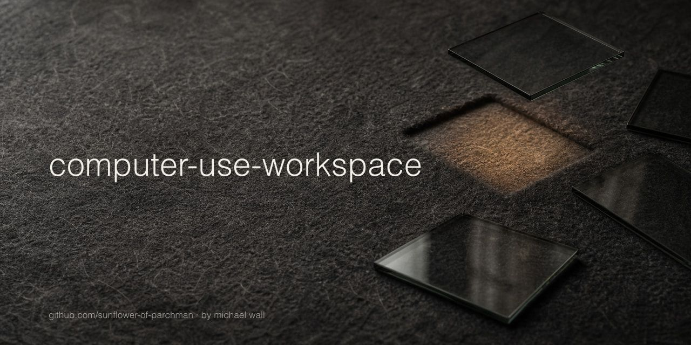

# Computer Use Workspace



Computer Use Workspace is a Codex skill that extends Computer Use with a display-aware workspace lifecycle on macOS. It adds a repeatable technique for planning application layouts, placing task windows, restoring focus, and cleaning up the resources created during a task.

## What It Does

- Plans the complete multi-application layout before launch.
- Places and verifies each new task window.
- Adapts the remaining layout to each application's actual launch size.
- Tracks task ownership with lifecycle receipts.
- Restores the application and display the user was working in.
- Cleans up task-owned resources or leaves them open when requested.

## Requirements

- macOS
- Swift toolchain
- Codex with Computer Use
- Screen Recording permission
- Accessibility permission

## Install

```bash
mkdir -p "$HOME/.codex/skills"
git clone https://github.com/sunflower-of-parchman/computer-use-workspace.git \
  "$HOME/.codex/skills/computer-use-workspace"
bash "$HOME/.codex/skills/computer-use-workspace/scripts/build.sh" --release --verify
```

Restart Codex if the skill has not appeared, then invoke `$computer-use-workspace`.

For a development checkout, keep the repository as the source of truth:

```bash
git clone https://github.com/sunflower-of-parchman/computer-use-workspace.git \
  "$HOME/code/computer-use-workspace"
cd "$HOME/code/computer-use-workspace"
bash scripts/build.sh
mkdir -p "$HOME/.codex/skills"
ln -s "$PWD" "$HOME/.codex/skills/computer-use-workspace"
```

## Enable It For Computer Use

Add this instruction to your global or project `AGENTS.md`:

> Before Computer Use starts a macOS application or creates a new top-level application window for the task, use `$computer-use-workspace` to reserve a safe display region. Place and verify the window immediately after launch, retain its lifecycle record while working, and use that record at completion to clean up task-owned apps, windows, and tabs while keeping pre-existing, edited, ambiguous, and user-requested-visible state in place.

## Use

Preflight the complete application group:

```bash
WORKSPACE="$HOME/.codex/skills/computer-use-workspace/scripts/computer-use-workspace"
"$WORKSPACE" preflight --request '[
  {"app":"com.apple.Chess","width":620,"height":560},
  {"app":"com.apple.SystemProfiler","width":720,"height":520}
]'
```

Follow the returned `launchOrder`. After each application opens, place its window and retain the returned `lifecycleReceipt`:

```bash
"$WORKSPACE" place --reservation RESERVATION_ID
```

Finish the batch with the receipt map:

```bash
"$WORKSPACE" finish-batch \
  --batch BATCH_ID \
  --receipts '{"RESERVATION_ID_1":"LIFECYCLE_RECEIPT_1","RESERVATION_ID_2":"LIFECYCLE_RECEIPT_2"}' \
  --apply
```

Add `--leave-open` when the task windows should remain visible. See [SKILL.md](SKILL.md) for the complete lifecycle and recovery workflow.

## Safety and Privacy

Computer Use Workspace starts from an exact pre-task baseline. Existing windows stay in place, edited and active state stays visible, and each later window action requires the matching lifecycle receipt.

The helper reads display bounds, application and process identifiers, window identifiers, and window bounds through Core Graphics and Accessibility. Lifecycle state stays in `/private/tmp` with permissions for the current macOS user. Screen content, window titles, keystrokes, credentials, and network traffic stay outside the helper.

macOS may briefly show a new window at its default launch position. The helper places it as soon as the window becomes available.

## Verify

```bash
bash scripts/build.sh --release --verify
```

## Security

See [SECURITY.md](SECURITY.md) for private vulnerability reporting.

## License

MIT. See [LICENSE](LICENSE).
